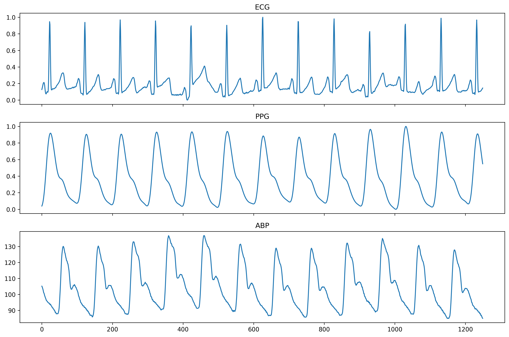
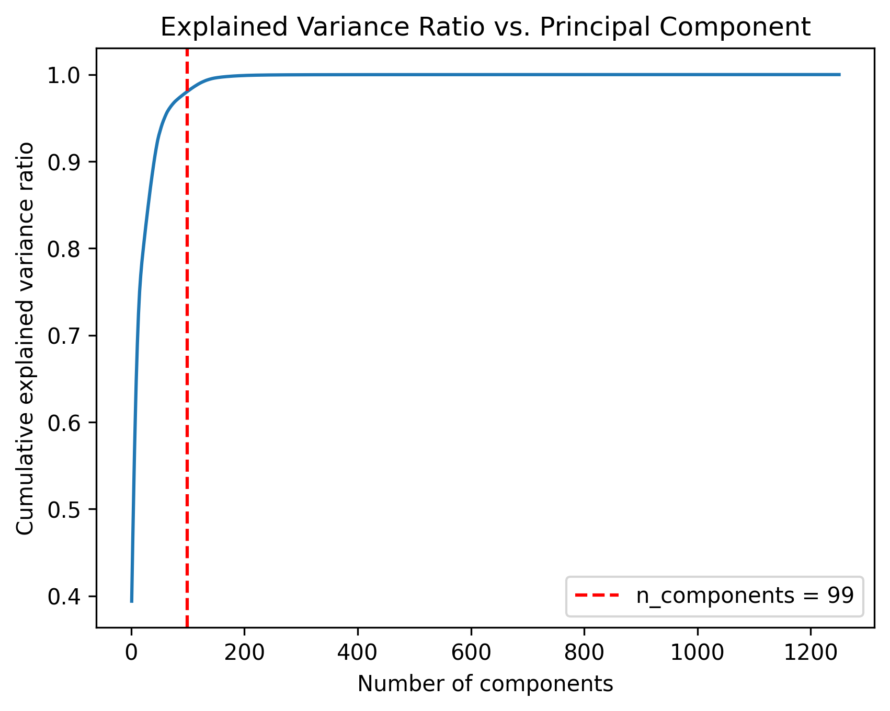
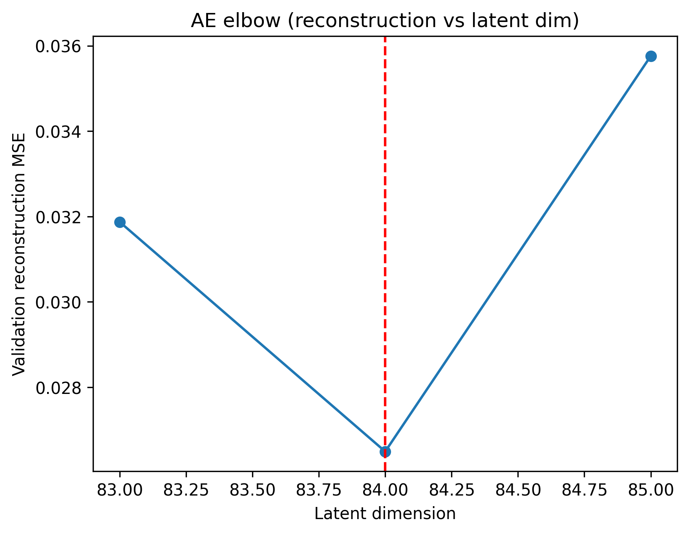
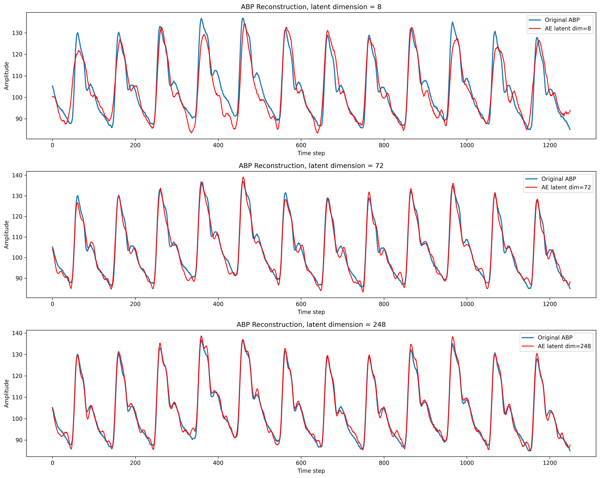

# Cuffless Blood Pressure Estimation with PulseDB

This project studies cuffless blood pressure estimation from physiological waveforms using the PulseDB dataset. The goal is to predict systolic blood pressure (SBP) and diastolic blood pressure (DBP) from electrocardiogram (ECG) and photoplethysmogram (PPG) signals.

The project compares classical linear baselines with several neural network architectures, including fully connected networks, convolutional networks, recurrent models, hybrid convolutional-recurrent models, and Transformer-based sequence models.

## Project Overview

Cuffless blood pressure estimation is a challenging time-series regression problem. Each sample contains ECG and PPG waveform segments, and the target variables are SBP and DBP.

This project focuses on three questions:

1. Can ECG and PPG waveforms be used to estimate SBP and DBP?
2. Which model architectures are most effective for waveform-based blood pressure prediction?
3. How do model results differ between calibration-based and calibration-free evaluation settings?

## Dataset

This project uses the PulseDB dataset, a cleaned cardiovascular waveform dataset designed for benchmarking cuffless blood pressure estimation methods.

Reference paper:

Wang, W., Mohseni, P., Kilgore, K. L., & Najafizadeh, L.
*PulseDB: A large, cleaned dataset based on MIMIC-III and VitalDB for benchmarking cuff-less blood pressure estimation methods.*
Frontiers in Digital Health, 2022.
https://doi.org/10.3389/fdgth.2022.1090854

The dataset contains ECG, PPG, and arterial blood pressure (ABP) waveform segments, together with subject-level metadata and reference SBP/DBP values.

The raw data files are not included in this repository because of their size. The processed arrays are also excluded.

### Example Physiological Waveforms

Representative ECG, PPG, and ABP waveform segments from the PulseDB dataset.

<p align="center">
  
</p>

## Repository Structure

```text
cuffless-bp-pulsedb/
├── figures/                 # Generated plots
├── notebooks/               # Colab/Jupyter notebooks
├── results/                 # Summary tables and model metrics
├── src/                     # Reusable Python modules
│   ├── data.py              # Data loading, filtering, splitting, summary utilities
│   ├── models.py            # Neural network architectures
│   └── train.py             # Training, evaluation, metrics, and plotting utilities
├── .gitignore
└── README.md
```

## Notebooks

The project is organized into the following notebooks.

### `00_Setup.ipynb`

Creates the project directory structure and writes reusable helper modules into `src/`.

### `01_data_preparation.ipynb`

Loads PulseDB `.mat` files, extracts metadata and ECG/PPG/ABP signals, removes physiologically implausible records, creates train/validation splits, computes normalization statistics, and saves processed artifacts.

### `02_bp_prediction.ipynb`

Trains and evaluates blood pressure prediction models using ECG and PPG waveforms. Models are evaluated on both calibration-based and calibration-free test splits.

### `03_signal_representation.ipynb`

Studies ABP waveform representation using PCA and fully connected autoencoders. The goal is to examine whether ABP waveforms have lower-dimensional structure.

## Methods

### Data Processing

The preprocessing pipeline includes:

- Loading PulseDB `.mat` files
- Extracting ECG, PPG, ABP, and subject metadata
- Filtering implausible physiological values
- Creating subject-level train/validation splits
- Computing ECG/PPG normalization statistics from the training split only
- Saving processed arrays and metadata for downstream notebooks

The filtering ranges used include:

| Variable | Range |
|---|---:|
| Height | 120–220 cm |
| Weight | 25–200 kg |
| BMI | 13–60 |
| SBP | 70–250 mmHg |
| DBP | 30–150 mmHg |

### Models

The following models were evaluated:

| Model | Description |
|---|---|
| Ridge Regression | Linear baseline using downsampled ECG/PPG features |
| FCNN | Fully connected neural network on flattened ECG/PPG waveforms |
| 1D CNN | Multi-scale convolutional neural network for local waveform morphology |
| RNN | Vanilla recurrent neural network |
| GRU | Gated recurrent unit model for temporal modeling |
| LSTM | Long short-term memory network |
| ConvGRU | Convolutional feature extractor followed by GRU |
| ConvLSTM | Convolutional feature extractor followed by LSTM |
| Transformer | Convolutional downsampling followed by Transformer encoder |

### Evaluation Metrics

Models are evaluated using:

| Metric | Description |
|---|---|
| ME | Mean error |
| SDE | Standard deviation of error |
| MAE | Mean absolute error |
| R² | Coefficient of determination |
| Time | Training time in seconds |
| Number of epochs | Number of training epochs before stopping |

SBP and DBP are evaluated separately.

## Results

### Calibration-Based Evaluation

| Model | SBP MAE | SBP R² | DBP MAE | DBP R² |
|---|---:|---:|---:|---:|
| Ridge Regression | 14.21 | 0.074 | 8.98 | 0.098 |
| FCNN | 13.71 | 0.123 | 8.95 | 0.098 |
| 1D CNN | 11.91 | 0.346 | 7.84 | 0.296 |
| GRU | 11.62 | 0.364 | 7.90 | 0.289 |
| RNN | 14.83 | 0.002 | 9.42 | 0.007 |
| LSTM | 14.80 | 0.003 | 9.41 | 0.006 |
| ConvGRU | 11.17 | 0.409 | 7.65 | 0.327 |
| ConvLSTM | 11.39 | 0.387 | 7.82 | 0.302 |
| Transformer | 10.62 | 0.443 | 7.26 | 0.375 |

### Calibration-Free Evaluation

| Model | SBP MAE | SBP R² | DBP MAE | DBP R² |
|---|---:|---:|---:|---:|
| Ridge Regression | 14.29 | 0.079 | 9.03 | 0.075 |
| FCNN | 14.17 | 0.075 | 9.35 | 0.006 |
| 1D CNN | 12.70 | 0.262 | 8.14 | 0.237 |
| GRU | 12.49 | 0.269 | 8.14 | 0.233 |
| RNN | 14.90 | 0.003 | 9.37 | 0.006 |
| LSTM | 14.86 | 0.005 | 9.37 | 0.006 |
| ConvGRU | 12.48 | 0.262 | 8.19 | 0.221 |
| ConvLSTM | 12.63 | 0.246 | 8.24 | 0.211 |
| Transformer | 13.36 | 0.167 | 8.68 | 0.110 |

## Key Findings

The main findings are:

1. Convolutional and gated recurrent models outperform linear and fully connected baselines.
2. The 1D CNN and GRU models perform strongly in the calibration-free setting, suggesting that local waveform morphology and gated temporal structure are important for blood pressure estimation.
3. Vanilla RNN and LSTM models perform poorly on raw long waveform sequences, likely because the 1,250-step input sequences are difficult to model directly without convolutional feature extraction.
4. Hybrid convolutional-recurrent models improve calibration-based performance, with ConvGRU achieving strong results.
5. The Transformer achieves the best calibration-based performance but generalizes less well in the calibration-free setting.
6. Calibration-free prediction remains substantially more difficult than calibration-based prediction.

## Signal Representation Analysis

In addition to blood pressure prediction, ABP signal representation was studied using PCA and fully connected autoencoders.

The representation analysis investigates whether ABP waveforms can be compressed into a lower-dimensional latent space while preserving waveform structure. PCA provides a linear dimensionality-reduction baseline, while the autoencoder provides a nonlinear representation-learning approach.

### PCA Dimensionality Analysis

Principal component analysis (PCA) was used to study the intrinsic dimensionality of ABP waveforms.

<p align="center">
  
</p>

### Autoencoder Latent Dimension Analysis

Reconstruction error decreases as the latent dimension increases, suggesting that ABP waveforms have a lower-dimensional nonlinear representation.

<p align="center">
  
</p>

Results are saved in:

```text
results/representation_results.csv
```

### ABP Signal Reconstruction

Examples of reconstructed arterial blood pressure (ABP) waveforms generated by the autoencoder using different latent dimensions.

<p align="center">
  
</p>

## How to Run

This project was developed in Google Colab. Run notebooks in order:

```text
00 Setup.ipynb
01_data_preparation.ipynb
02_bp_prediction.ipynb
03_signal_representation.ipynb
```

The processed `.npy` arrays are generated by the data preparation notebook and are excluded from GitHub because of their size.


## Technologies Used

- Python
- NumPy
- pandas
- scikit-learn
- PyTorch
- matplotlib
- Google Colab
- Git/GitHub

## Author

Yi-Heng Tsai
